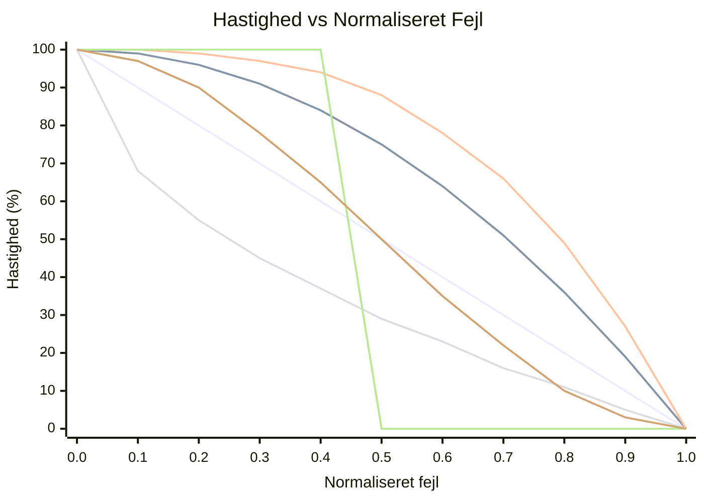

# OFDL PD ColorSpeed Controller — Brugervejledning

Beregner motorhastighed ud fra to farvesensorværdier ved hjælp af en fejlbaseret kurve. Når robotten er centreret på linjen (sensorerne er i balance), er hastigheden på sit maksimum (`BaseSpeed`). Efterhånden som fejlen vokser, falder hastigheden mod `MinSpeed` — formen på faldet afhænger af den valgte tilstand.

---

## Koncept

```
error = |P1 − P2|  (0 = centered, MaxError = fully off-line)

normalized_error = error / MaxError   (0.0 to 1.0)

speed = BaseSpeed − (BaseSpeed − MinSpeed) × f(normalized_error)
```

Hvor `f(x)` er kurvefunktionen for den valgte tilstand:

| Tilstand | Formel `f(x)` | Adfærd |
|----------|---------------|--------|
| `CS_Linear` | `x` | Konstant deceleration med fejlen |
| `CS_Quadratic` | `x²` | Langsomt fald i starten, hurtigt nær kanten |
| `CS_Cubic` | `x³` | Endnu mere aggressivt nær kanten |
| `CS_Sqrt` | `√x` | Hurtigt fald nær centrum, blidt ved kanten |
| `CS_Step` | `0 if x<0.5, 1 if x≥0.5` | Fuld hastighed til halvvejs, derefter MinSpeed |
| `CS_Smooth` | glattet over N prøver | Fjerner sensorstøjspidser |

### Sammenligning af kurvefasong (BaseSpeed=100, MinSpeed=0)



| Farve | Tilstand |
|-------|----------|
| 🔵 Blå | `CS_Linear` |
| 🔴 Rød | `CS_Quadratic` |
| 🟢 Grøn | `CS_Cubic` |
| 🟣 Lilla | `CS_Sqrt` |
| 🟠 Orange | `CS_Step` |
| 🟡 Gul | `CS_Smooth` |

> ※ Farver kan variere afhængigt af Mermaid-temaindstillinger.

---

## Opsætning

### Trin 1 — Konfigurationsblok (kør én gang før løkken)

| Parameter | Beskrivelse | Typisk værdi |
|-----------|-------------|--------------|
| **BaseSpeed** | Hastighed når perfekt centreret (−100 til 100) | `50` |
| **MinSpeed** | Hastighed ved maksimal fejl (0 til 100) | `10` |
| **MaxError** | Fejlværdi der svarer til MinSpeed | `100` |
| **SmoothEnable** | Aktiver outputudjævning | `False` |
| **SmoothLevel** | Udjævningsvinduets størrelse (1–100) | `10` |

### Trin 2 — Hastighedsblok (kør ved hver løkkeiteration)

| Parameter | Beskrivelse |
|-----------|-------------|
| **P1** | Rå værdi fra venstre farvesensor |
| **P2** | Rå værdi fra højre farvesensor |

#### Output

| Output | Beskrivelse |
|--------|-------------|
| **SpeedOut** | Beregnet hastighed til motorerne |
| **CS1Out** | Kalibreret/videresendt P1-værdi |
| **CS2Out** | Kalibreret/videresendt P2-værdi |

---

## Tilstande

| Tilstand | Beskrivelse |
|----------|-------------|
| `Configuration` | Sæt BaseSpeed, MinSpeed, MaxError, udjævning |
| `CS_Linear` | Lineær hastighedskurve |
| `CS_Quadratic` | Kvadratisk hastighedskurve |
| `CS_Cubic` | Kubisk hastighedskurve |
| `CS_Sqrt` | Kvadratrodshastigheds­kurve |
| `CS_Step` | Trinfunktion (binær hastighed) |
| `CS_Smooth` | Glattet output med glidende gennemsnit |

---

## Typisk løkkestruktur

```
[Configuration: BaseSpeed=60, MinSpeed=15, MaxError=100, SmoothEnable=False]

Loop:
  [Read Color Sensor 1] → P1
  [Read Color Sensor 2] → P2
  [CS_Quadratic: P1, P2] → SpeedOut
  [PD Controller PDpwr mode: Power=SpeedOut, P1, P2]
```

---

## Valg af kurve

| Scenarie | Anbefalet tilstand |
|----------|--------------------|
| Simpel første opsætning | `CS_Linear` |
| Hurtige lige strækninger, langsom i sving | `CS_Quadratic` eller `CS_Cubic` |
| Sensorstøj forårsager hastighedsudsving | `CS_Smooth` |
| Test af tærskleladfærd | `CS_Step` |
| Gradvis opbremsning foretrukket | `CS_Sqrt` |

---

## Tips

- Brug **CS-kalibrerings**blokken først til at normalisere rå sensorværdier til 0–100 før de sendes til P1/P2.
- `SmoothEnable=True` med `SmoothLevel=5–15` reducerer jitter på støjende sensorer uden megen forsinkelse.
- Kombiner `SpeedOut` med **PD Controller** (`PDpwr_*`-tilstande) for et komplet linjeføg­ningssystem: ColorSpeed-blokken sætter grundhastigheden, og PD styrer.
