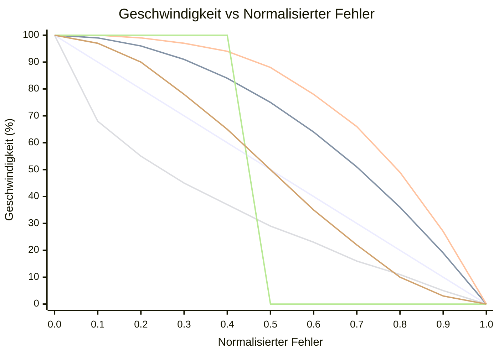

# OFDL PD ColorSpeed Controller — Benutzerhandbuch

Berechnet die Motorgeschwindigkeit aus zwei Farbsensorwerten mithilfe einer fehlerbasierenden Kurve. Wenn der Roboter auf der Linie zentriert ist (Sensoren ausbalanciert), ist die Geschwindigkeit maximal (`BaseSpeed`). Mit wachsendem Fehler sinkt die Geschwindigkeit in Richtung `MinSpeed` — die Form des Abfalls hängt vom gewählten Modus ab.

---

## Konzept

```
error = |P1 − P2|  (0 = centered, MaxError = fully off-line)

normalized_error = error / MaxError   (0.0 to 1.0)

speed = BaseSpeed − (BaseSpeed − MinSpeed) × f(normalized_error)
```

Dabei ist `f(x)` die Kurvenfunktion für den gewählten Modus:

| Modus | Formel `f(x)` | Verhalten |
|-------|---------------|-----------|
| `CS_Linear` | `x` | Gleichmäßige Verzögerung mit Fehler |
| `CS_Quadratic` | `x²` | Langsamer Abfall zuerst, schnell am Rand |
| `CS_Cubic` | `x³` | Noch aggressiver am Rand |
| `CS_Sqrt` | `√x` | Schneller Abfall nahe Mitte, sanft am Rand |
| `CS_Step` | `0 if x<0.5, 1 if x≥0.5` | Volle Geschwindigkeit bis zur Hälfte, dann MinSpeed |
| `CS_Smooth` | über N Samples geglättet | Entfernt Sensorrausch-Spitzen |

### Kurvenformvergleich (BaseSpeed=100, MinSpeed=0)



| Farbe | Modus |
|-------|-------|
| 🔵 Blau | `CS_Linear` |
| 🔴 Rot | `CS_Quadratic` |
| 🟢 Grün | `CS_Cubic` |
| 🟣 Lila | `CS_Sqrt` |
| 🟠 Orange | `CS_Step` |
| 🟡 Gelb | `CS_Smooth` |

> ※ Farben können je nach Mermaid-Theme variieren.

---

## Einrichtung

### Schritt 1 — Konfigurationsblock (einmal vor der Schleife ausführen)

| Parameter | Beschreibung | Typischer Wert |
|-----------|-------------|----------------|
| **BaseSpeed** | Geschwindigkeit bei perfekter Zentrierung (−100 bis 100) | `50` |
| **MinSpeed** | Geschwindigkeit bei maximalem Fehler (0 bis 100) | `10` |
| **MaxError** | Fehlerwert, der MinSpeed entspricht | `100` |
| **SmoothEnable** | Ausgangsglättung aktivieren | `False` |
| **SmoothLevel** | Glättungsfenstergröße (1–100) | `10` |

### Schritt 2 — Geschwindigkeitsblock (bei jeder Schleifeniteration ausführen)

| Parameter | Beschreibung |
|-----------|-------------|
| **P1** | Rohwert des linken Farbsensors |
| **P2** | Rohwert des rechten Farbsensors |

#### Ausgaben

| Ausgabe | Beschreibung |
|---------|-------------|
| **SpeedOut** | Berechnete auf die Motoren anzuwendende Geschwindigkeit |
| **CS1Out** | Kalibrierter/durchgereichter P1-Wert |
| **CS2Out** | Kalibrierter/durchgereichter P2-Wert |

---

## Modi

| Modus | Beschreibung |
|-------|-------------|
| `Configuration` | BaseSpeed, MinSpeed, MaxError, Glättung einstellen |
| `CS_Linear` | Lineare Geschwindigkeitskurve |
| `CS_Quadratic` | Quadratische Geschwindigkeitskurve |
| `CS_Cubic` | Kubische Geschwindigkeitskurve |
| `CS_Sqrt` | Quadratwurzel-Geschwindigkeitskurve |
| `CS_Step` | Stufenfunktion (binäre Geschwindigkeit) |
| `CS_Smooth` | Geglättete Ausgabe mit gleitendem Durchschnitt |

---

## Typische Schleifenstruktur

```
[Configuration: BaseSpeed=60, MinSpeed=15, MaxError=100, SmoothEnable=False]

Loop:
  [Read Color Sensor 1] → P1
  [Read Color Sensor 2] → P2
  [CS_Quadratic: P1, P2] → SpeedOut
  [PD Controller PDpwr mode: Power=SpeedOut, P1, P2]
```

---

## Kurvenauswahl

| Szenario | Empfohlener Modus |
|----------|------------------|
| Einfache Ersteinrichtung | `CS_Linear` |
| Schnell auf Geraden, langsam in Kurven | `CS_Quadratic` oder `CS_Cubic` |
| Sensorrauschen verursacht Geschwindigkeitsschwankungen | `CS_Smooth` |
| Schwellwertverhalten testen | `CS_Step` |
| Allmähliche Verlangsamung bevorzugt | `CS_Sqrt` |

---

## Tipps

- Verwenden Sie zuerst den **CS Calibration**-Block, um Rohsensorwerte auf 0–100 zu normalisieren, bevor Sie sie in P1/P2 einspeisen.
- `SmoothEnable=True` mit `SmoothLevel=5–15` reduziert Jitter bei verrauschten Sensoren ohne viel Verzögerung.
- Kombinieren Sie `SpeedOut` mit dem **PD Controller** (`PDpwr_*`-Modi) für ein vollständiges Linienfolgesystem: Der ColorSpeed-Block setzt die Basisgeschwindigkeit, und PD steuert.
