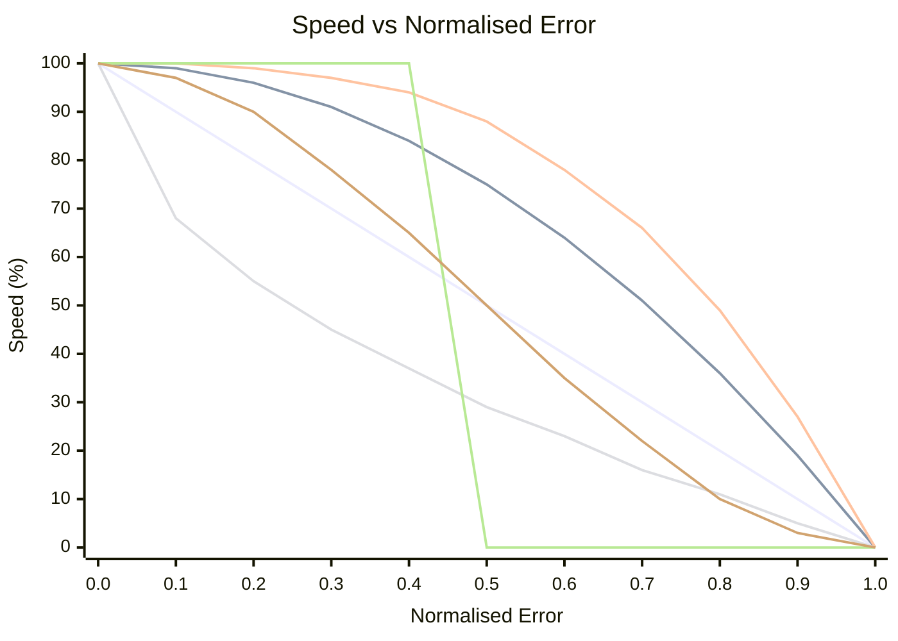

# OFDL PD ColorSpeed Controller — Usage Guide

Calculates motor speed from two colour sensor values using an error-based curve. When the robot is centred on the line (sensors balanced), speed is at its maximum (`BaseSpeed`). As the error grows, speed drops toward `MinSpeed` — the shape of the drop depends on the selected mode.

---

## Concept

```
error = |P1 − P2|  (0 = centered, MaxError = fully off-line)

normalized_error = error / MaxError   (0.0 to 1.0)

speed = BaseSpeed − (BaseSpeed − MinSpeed) × f(normalized_error)
```

Where `f(x)` is the curve function for the selected mode:

| Mode | Formula `f(x)` | Behaviour |
|------|----------------|-----------|
| `CS_Linear` | `x` | Constant deceleration with error |
| `CS_Quadratic` | `x²` | Slow drop at first, fast near edge |
| `CS_Cubic` | `x³` | Even more aggressive near edge |
| `CS_Sqrt` | `√x` | Fast drop near centre, gentle at edge |
| `CS_Step` | `0 if x<0.5, 1 if x≥0.5` | Full speed until halfway, then MinSpeed |
| `CS_Smooth` | `3x²−2x³` | Smooth speed transitions, removes noise |

### Curve shape comparison (BaseSpeed=100, MinSpeed=0)



| Colour | Mode |
|--------|------|
| 🔵 Blue | `CS_Linear` |
| 🔴 Red | `CS_Quadratic` |
| 🟢 Green | `CS_Cubic` |
| 🟣 Purple | `CS_Sqrt` |
| 🟠 Orange | `CS_Step` |
| 🟡 Yellow | `CS_Smooth` |

> ※ Colours may vary depending on Mermaid theme settings.

---

## Setup

### Step 1 — Configuration block (run once before the loop)

| Parameter | Description | Typical value |
|-----------|-------------|---------------|
| **BaseSpeed** | Speed when perfectly centred (−100 to 100) | `50` |
| **MinSpeed** | Speed at maximum error (0 to 100) | `10` |
| **MaxError** | Error value that maps to MinSpeed | `100` |
| **SmoothEnable** | Enable output smoothing | `False` |
| **SmoothLevel** | Smoothing window size (1–100) | `10` |

### Step 2 — Speed block (run every loop iteration)

| Parameter | Description |
|-----------|-------------|
| **P1** | Left colour sensor raw value |
| **P2** | Right colour sensor raw value |

#### Outputs

| Output | Description |
|--------|-------------|
| **SpeedOut** | Calculated speed to apply to motors |
| **CS1Out** | Calibrated/passed-through P1 value |
| **CS2Out** | Calibrated/passed-through P2 value |

---

## Modes

| Mode | Description |
|------|-------------|
| `Configuration` | Set BaseSpeed, MinSpeed, MaxError, smoothing |
| `CS_Linear` | Linear speed curve |
| `CS_Quadratic` | Quadratic speed curve |
| `CS_Cubic` | Cubic speed curve |
| `CS_Sqrt` | Square-root speed curve |
| `CS_Step` | Step function (binary speed) |
| `CS_Smooth` | Smoothed output using rolling average |

---

## Typical loop structure

```
[Configuration: BaseSpeed=60, MinSpeed=15, MaxError=100, SmoothEnable=False]

Loop:
  [Read Color Sensor 1] → P1
  [Read Color Sensor 2] → P2
  [CS_Quadratic: P1, P2] → SpeedOut
  [PD Controller PDpwr mode: Power=SpeedOut, P1, P2]
```

---

## Choosing a curve

| Scenario | Recommended mode |
|----------|-----------------|
| Simple first setup | `CS_Linear` |
| Fast straight sections, slow on curves | `CS_Quadratic` or `CS_Cubic` |
| Sensor noise causing speed fluctuation | `CS_Smooth` |
| Testing threshold behaviour | `CS_Step` |
| Gradual slow-down preferred | `CS_Sqrt` |

---

## Tips

- Use **CS Calibration** block first to normalise raw sensor values to 0–100 before feeding into P1/P2.
- `SmoothEnable=True` with `SmoothLevel=5–15` reduces jitter on noisy sensors without much lag.
- Combine `SpeedOut` with the **PD Controller** (`PDpwr_*` modes) for a complete line-following system: the ColorSpeed block sets the base speed, and PD steers.
