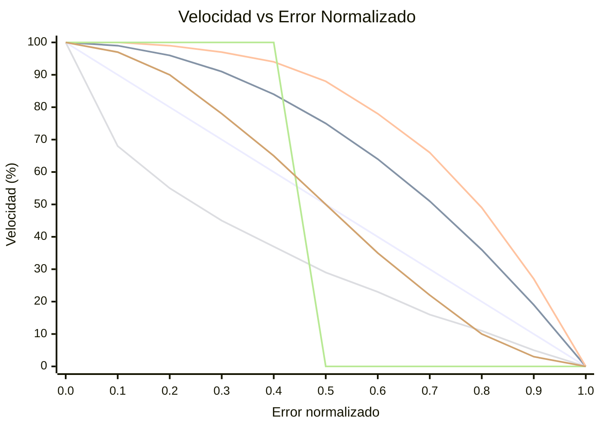

# OFDL PD ColorSpeed Controller — Guía de uso

Calcula la velocidad del motor a partir de dos valores de sensor de color usando una curva basada en error. Cuando el robot está centrado sobre la línea (sensores equilibrados), la velocidad está al máximo (`BaseSpeed`). A medida que el error crece, la velocidad disminuye hacia `MinSpeed` — la forma de la caída depende del modo seleccionado.

---

## Concepto

```
error = |P1 − P2|  (0 = centered, MaxError = fully off-line)

normalized_error = error / MaxError   (0.0 to 1.0)

speed = BaseSpeed − (BaseSpeed − MinSpeed) × f(normalized_error)
```

Donde `f(x)` es la función de curva para el modo seleccionado:

| Modo | Fórmula `f(x)` | Comportamiento |
|------|----------------|---------------|
| `CS_Linear` | `x` | Desaceleración constante con el error |
| `CS_Quadratic` | `x²` | Caída lenta al principio, rápida cerca del borde |
| `CS_Cubic` | `x³` | Aún más agresivo cerca del borde |
| `CS_Sqrt` | `√x` | Caída rápida cerca del centro, suave en el borde |
| `CS_Step` | `0 if x<0.5, 1 if x≥0.5` | Velocidad máxima hasta la mitad, luego MinSpeed |
| `CS_Smooth` | suavizado sobre N muestras | Elimina picos de ruido del sensor |

### Comparación de formas de curva (BaseSpeed=100, MinSpeed=0)



| Color | Modo |
|-------|------|
| 🔵 Azul | `CS_Linear` |
| 🔴 Rojo | `CS_Quadratic` |
| 🟢 Verde | `CS_Cubic` |
| 🟣 Morado | `CS_Sqrt` |
| 🟠 Naranja | `CS_Step` |
| 🟡 Amarillo | `CS_Smooth` |

> ※ Los colores pueden variar según la configuración del tema de Mermaid.

---

## Configuración

### Paso 1 — Bloque de configuración (ejecutar una vez antes del bucle)

| Parámetro | Descripción | Valor típico |
|-----------|-------------|-------------|
| **BaseSpeed** | Velocidad cuando está perfectamente centrado (−100 a 100) | `50` |
| **MinSpeed** | Velocidad al error máximo (0 a 100) | `10` |
| **MaxError** | Valor de error que corresponde a MinSpeed | `100` |
| **SmoothEnable** | Habilitar suavizado de salida | `False` |
| **SmoothLevel** | Tamaño de ventana de suavizado (1–100) | `10` |

### Paso 2 — Bloque de velocidad (ejecutar en cada iteración del bucle)

| Parámetro | Descripción |
|-----------|-------------|
| **P1** | Valor bruto del sensor de color izquierdo |
| **P2** | Valor bruto del sensor de color derecho |

#### Salidas

| Salida | Descripción |
|--------|-------------|
| **SpeedOut** | Velocidad calculada a aplicar a los motores |
| **CS1Out** | Valor P1 calibrado/transmitido |
| **CS2Out** | Valor P2 calibrado/transmitido |

---

## Modos

| Modo | Descripción |
|------|-------------|
| `Configuration` | Establecer BaseSpeed, MinSpeed, MaxError, suavizado |
| `CS_Linear` | Curva de velocidad lineal |
| `CS_Quadratic` | Curva de velocidad cuadrática |
| `CS_Cubic` | Curva de velocidad cúbica |
| `CS_Sqrt` | Curva de velocidad raíz cuadrada |
| `CS_Step` | Función escalón (velocidad binaria) |
| `CS_Smooth` | Salida suavizada con media móvil |

---

## Estructura de bucle típica

```
[Configuration: BaseSpeed=60, MinSpeed=15, MaxError=100, SmoothEnable=False]

Loop:
  [Read Color Sensor 1] → P1
  [Read Color Sensor 2] → P2
  [CS_Quadratic: P1, P2] → SpeedOut
  [PD Controller PDpwr mode: Power=SpeedOut, P1, P2]
```

---

## Cómo elegir una curva

| Escenario | Modo recomendado |
|-----------|-----------------|
| Primera configuración simple | `CS_Linear` |
| Secciones rectas rápidas, curvas lentas | `CS_Quadratic` o `CS_Cubic` |
| Ruido del sensor causando fluctuación de velocidad | `CS_Smooth` |
| Probar comportamiento de umbral | `CS_Step` |
| Se prefiere ralentización gradual | `CS_Sqrt` |

---

## Consejos

- Use primero el bloque **CS Calibration** para normalizar los valores brutos del sensor a 0–100 antes de alimentarlos en P1/P2.
- `SmoothEnable=True` con `SmoothLevel=5–15` reduce el jitter en sensores con ruido sin mucha latencia.
- Combine `SpeedOut` con el **PD Controller** (modos `PDpwr_*`) para un sistema completo de seguimiento de línea: el bloque ColorSpeed establece la velocidad base y PD dirige.
