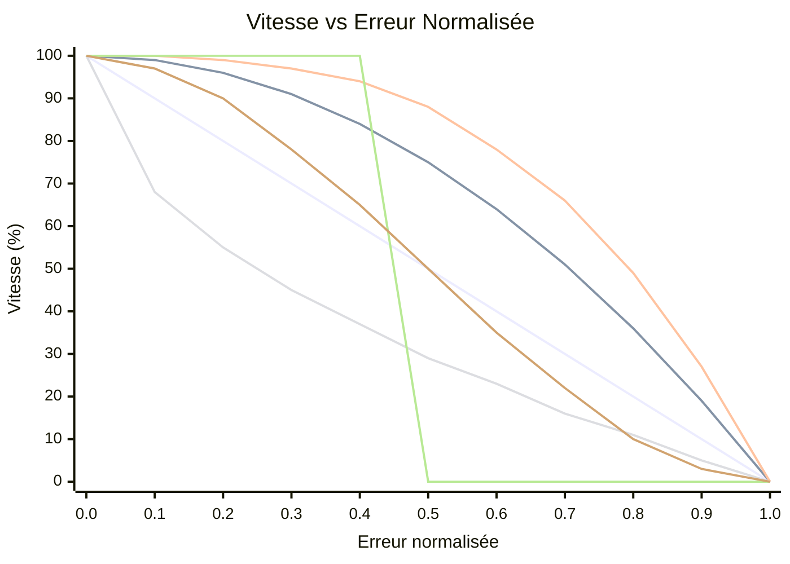

# OFDL PD ColorSpeed Controller — Guide d'utilisation

Calcule la vitesse moteur à partir de deux valeurs de capteurs de couleur à l'aide d'une courbe basée sur l'erreur. Quand le robot est centré sur la ligne (capteurs équilibrés), la vitesse est maximale (`BaseSpeed`). À mesure que l'erreur augmente, la vitesse diminue vers `MinSpeed` — la forme de la chute dépend du mode sélectionné.

---

## Concept

```
error = |P1 − P2|  (0 = centered, MaxError = fully off-line)

normalized_error = error / MaxError   (0.0 to 1.0)

speed = BaseSpeed − (BaseSpeed − MinSpeed) × f(normalized_error)
```

Où `f(x)` est la fonction de courbe pour le mode sélectionné :

| Mode | Formule `f(x)` | Comportement |
|------|----------------|-------------|
| `CS_Linear` | `x` | Décélération constante avec l'erreur |
| `CS_Quadratic` | `x²` | Chute lente au début, rapide près du bord |
| `CS_Cubic` | `x³` | Encore plus agressif près du bord |
| `CS_Sqrt` | `√x` | Chute rapide près du centre, douce au bord |
| `CS_Step` | `0 if x<0.5, 1 if x≥0.5` | Pleine vitesse jusqu'à mi-chemin, puis MinSpeed |
| `CS_Smooth` | lissé sur N échantillons | Supprime les pics de bruit capteur |

### Comparaison des formes de courbe (BaseSpeed=100, MinSpeed=0)



| Couleur | Mode |
|---------|------|
| 🔵 Bleu | `CS_Linear` |
| 🔴 Rouge | `CS_Quadratic` |
| 🟢 Vert | `CS_Cubic` |
| 🟣 Violet | `CS_Sqrt` |
| 🟠 Orange | `CS_Step` |
| 🟡 Jaune | `CS_Smooth` |

> ※ Les couleurs peuvent varier selon le thème Mermaid.

---

## Configuration

### Étape 1 — Bloc de configuration (exécuter une fois avant la boucle)

| Paramètre | Description | Valeur typique |
|-----------|-------------|----------------|
| **BaseSpeed** | Vitesse quand parfaitement centré (−100 à 100) | `50` |
| **MinSpeed** | Vitesse à erreur maximale (0 à 100) | `10` |
| **MaxError** | Valeur d'erreur correspondant à MinSpeed | `100` |
| **SmoothEnable** | Activer le lissage de sortie | `False` |
| **SmoothLevel** | Taille de la fenêtre de lissage (1–100) | `10` |

### Étape 2 — Bloc de vitesse (exécuter à chaque itération de boucle)

| Paramètre | Description |
|-----------|-------------|
| **P1** | Valeur brute du capteur de couleur gauche |
| **P2** | Valeur brute du capteur de couleur droit |

#### Sorties

| Sortie | Description |
|--------|-------------|
| **SpeedOut** | Vitesse calculée à appliquer aux moteurs |
| **CS1Out** | Valeur P1 calibrée/transmise |
| **CS2Out** | Valeur P2 calibrée/transmise |

---

## Modes

| Mode | Description |
|------|-------------|
| `Configuration` | Définir BaseSpeed, MinSpeed, MaxError, lissage |
| `CS_Linear` | Courbe de vitesse linéaire |
| `CS_Quadratic` | Courbe de vitesse quadratique |
| `CS_Cubic` | Courbe de vitesse cubique |
| `CS_Sqrt` | Courbe de vitesse racine carrée |
| `CS_Step` | Fonction en escalier (vitesse binaire) |
| `CS_Smooth` | Sortie lissée avec moyenne glissante |

---

## Structure de boucle typique

```
[Configuration: BaseSpeed=60, MinSpeed=15, MaxError=100, SmoothEnable=False]

Loop:
  [Read Color Sensor 1] → P1
  [Read Color Sensor 2] → P2
  [CS_Quadratic: P1, P2] → SpeedOut
  [PD Controller PDpwr mode: Power=SpeedOut, P1, P2]
```

---

## Choisir une courbe

| Scénario | Mode recommandé |
|----------|----------------|
| Première configuration simple | `CS_Linear` |
| Sections droites rapides, courbes lentes | `CS_Quadratic` ou `CS_Cubic` |
| Bruit capteur causant des fluctuations de vitesse | `CS_Smooth` |
| Test du comportement de seuil | `CS_Step` |
| Ralentissement progressif préféré | `CS_Sqrt` |

---

## Conseils

- Utilisez d'abord le bloc **CS Calibration** pour normaliser les valeurs brutes des capteurs à 0–100 avant de les alimenter dans P1/P2.
- `SmoothEnable=True` avec `SmoothLevel=5–15` réduit le scintillement sur les capteurs bruyants sans beaucoup de latence.
- Combinez `SpeedOut` avec le **PD Controller** (modes `PDpwr_*`) pour un système de suivi de ligne complet : le bloc ColorSpeed définit la vitesse de base, et PD dirige.
