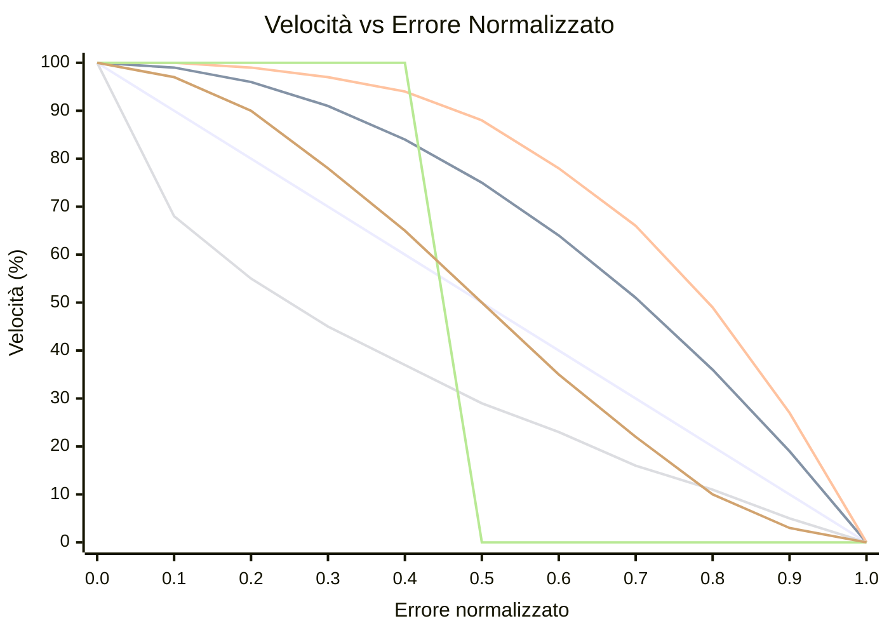

# OFDL PD ColorSpeed Controller — Guida all'uso

Calcola la velocità del motore da due valori di sensore di colore usando una curva basata sull'errore. Quando il robot è centrato sulla linea (sensori bilanciati), la velocità è al massimo (`BaseSpeed`). All'aumentare dell'errore, la velocità scende verso `MinSpeed` — la forma della discesa dipende dalla modalità selezionata.

---

## Concetto

```
error = |P1 − P2|  (0 = centered, MaxError = fully off-line)

normalized_error = error / MaxError   (0.0 to 1.0)

speed = BaseSpeed − (BaseSpeed − MinSpeed) × f(normalized_error)
```

Dove `f(x)` è la funzione di curva per la modalità selezionata:

| Modalità | Formula `f(x)` | Comportamento |
|----------|----------------|--------------|
| `CS_Linear` | `x` | Decelerazione costante con l'errore |
| `CS_Quadratic` | `x²` | Caduta lenta all'inizio, veloce vicino al bordo |
| `CS_Cubic` | `x³` | Ancora più aggressivo vicino al bordo |
| `CS_Sqrt` | `√x` | Caduta rapida vicino al centro, dolce al bordo |
| `CS_Step` | `0 if x<0.5, 1 if x≥0.5` | Velocità piena fino a metà, poi MinSpeed |
| `CS_Smooth` | smorzato su N campioni | Elimina i picchi di rumore del sensore |

### Confronto delle forme di curva (BaseSpeed=100, MinSpeed=0)



| Colore | Modalità |
|--------|----------|
| 🔵 Blu | `CS_Linear` |
| 🔴 Rosso | `CS_Quadratic` |
| 🟢 Verde | `CS_Cubic` |
| 🟣 Viola | `CS_Sqrt` |
| 🟠 Arancione | `CS_Step` |
| 🟡 Giallo | `CS_Smooth` |

> ※ I colori possono variare in base alle impostazioni del tema Mermaid.

---

## Configurazione

### Passo 1 — Blocco di configurazione (eseguire una volta prima del ciclo)

| Parametro | Descrizione | Valore tipico |
|-----------|-------------|--------------|
| **BaseSpeed** | Velocità quando perfettamente centrato (−100 a 100) | `50` |
| **MinSpeed** | Velocità all'errore massimo (0 a 100) | `10` |
| **MaxError** | Valore di errore che corrisponde a MinSpeed | `100` |
| **SmoothEnable** | Abilitare lo smorzamento dell'uscita | `False` |
| **SmoothLevel** | Dimensione finestra di smorzamento (1–100) | `10` |

### Passo 2 — Blocco velocità (eseguire ad ogni iterazione del ciclo)

| Parametro | Descrizione |
|-----------|-------------|
| **P1** | Valore grezzo del sensore di colore sinistro |
| **P2** | Valore grezzo del sensore di colore destro |

#### Uscite

| Uscita | Descrizione |
|--------|-------------|
| **SpeedOut** | Velocità calcolata da applicare ai motori |
| **CS1Out** | Valore P1 calibrato/trasmesso |
| **CS2Out** | Valore P2 calibrato/trasmesso |

---

## Modalità

| Modalità | Descrizione |
|----------|-------------|
| `Configuration` | Impostare BaseSpeed, MinSpeed, MaxError, smorzamento |
| `CS_Linear` | Curva di velocità lineare |
| `CS_Quadratic` | Curva di velocità quadratica |
| `CS_Cubic` | Curva di velocità cubica |
| `CS_Sqrt` | Curva di velocità radice quadrata |
| `CS_Step` | Funzione a gradino (velocità binaria) |
| `CS_Smooth` | Uscita smorzata con media mobile |

---

## Struttura tipica del ciclo

```
[Configuration: BaseSpeed=60, MinSpeed=15, MaxError=100, SmoothEnable=False]

Loop:
  [Read Color Sensor 1] → P1
  [Read Color Sensor 2] → P2
  [CS_Quadratic: P1, P2] → SpeedOut
  [PD Controller PDpwr mode: Power=SpeedOut, P1, P2]
```

---

## Scelta della curva

| Scenario | Modalità consigliata |
|----------|---------------------|
| Prima configurazione semplice | `CS_Linear` |
| Sezioni dritte veloci, curve lente | `CS_Quadratic` o `CS_Cubic` |
| Rumore del sensore che causa fluttuazione della velocità | `CS_Smooth` |
| Test del comportamento a soglia | `CS_Step` |
| Rallentamento graduale preferito | `CS_Sqrt` |

---

## Suggerimenti

- Usare prima il blocco **CS Calibration** per normalizzare i valori grezzi del sensore a 0–100 prima di alimentarli in P1/P2.
- `SmoothEnable=True` con `SmoothLevel=5–15` riduce il jitter su sensori rumorosi senza molta latenza.
- Combinare `SpeedOut` con il **PD Controller** (modalità `PDpwr_*`) per un sistema completo di line following: il blocco ColorSpeed imposta la velocità base e PD sterza.
