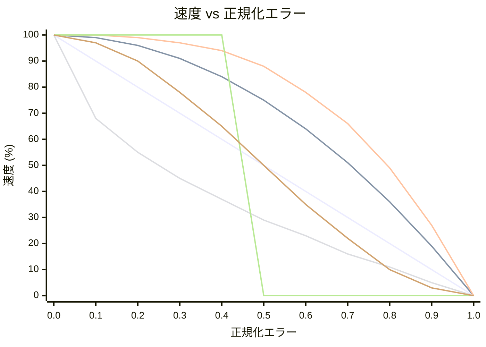

# OFDL PD ColorSpeed Controller — 使い方ガイド

エラーベースのカーブを使用して、2つのカラーセンサー値からモーター速度を計算します。ロボットがライン上に中心を合わせているとき（センサーがバランスしているとき）、速度は最大（`BaseSpeed`）になります。エラーが大きくなるにつれて速度は `MinSpeed` に向かって低下します。低下の形状は選択したモードによって異なります。

---

## 概念

```
error = |P1 − P2|  (0 = centered, MaxError = fully off-line)

normalized_error = error / MaxError   (0.0 to 1.0)

speed = BaseSpeed − (BaseSpeed − MinSpeed) × f(normalized_error)
```

`f(x)` は選択したモードのカーブ関数です:

| モード | 式 `f(x)` | こんな人向け | 安定性 | 速度 | 調整しやすさ |
|-------|-----------|------------|--------|------|------------|
| `CS_Linear` | `x` | 万能・初心者向け | ★★★☆☆ | ★★★☆☆ | ★★★★★ |
| `CS_Quadratic` | `x²` | 高速型・鋭い反応 | ★★★☆☆ | ★★★★☆ | ★★★☆☆ |
| `CS_Cubic` | `x³` | 競技最速向け | ★★☆☆☆ | ★★★★★ | ★★☆☆☆ |
| `CS_Sqrt` | `√x` | 安定型・穏やか | ★★★★☆ | ★★★☆☆ | ★★★★☆ |
| `CS_Step` | `0 if x<0.5, 1 if x≥0.5` | シンプル・手動チューニング向け | ★★☆☆☆ | ★★★☆☆ | ★★★★★ |
| `CS_Smooth` | `3x²−2x³` | 安定走行推奨 | ★★★★★ | ★★★☆☆ | ★★★★☆ |

### カーブ形状の比較（BaseSpeed=100, MinSpeed=0 の場合）



| 色 | モード |
|----|-------|
| 🔵 青 | `CS_Linear` |
| 🔴 赤 | `CS_Quadratic` |
| 🟢 緑 | `CS_Cubic` |
| 🟣 紫 | `CS_Sqrt` |
| 🟠 オレンジ | `CS_Step` |
| 🟡 黄 | `CS_Smooth` |

> ※ 色はMermaidのテーマ設定により異なる場合があります。

---

## セットアップ

### ステップ1 — 設定ブロック（ループ前に1回実行）

| パラメーター | 説明 | 典型的な値 |
|------------|------|----------|
| **BaseSpeed** | 完全に中心にいるときの速度（−100〜100） | `50` |
| **MinSpeed** | 最大エラー時の速度（0〜100） | `10` |
| **MaxError** | MinSpeedにマッピングされるエラー値 | `100` |
| **SmoothEnable** | 出力平滑化を有効にする | `False` |
| **SmoothLevel** | 平滑化ウィンドウサイズ（1〜100） | `10` |

### ステップ2 — 速度ブロック（ループの各反復で実行）

| パラメーター | 説明 |
|------------|------|
| **P1** | 左カラーセンサーの生値 |
| **P2** | 右カラーセンサーの生値 |

#### 出力

| 出力 | 説明 |
|-----|------|
| **SpeedOut** | モーターに適用する計算された速度 |
| **CS1Out** | キャリブレーション済み/パススルーのP1値 |
| **CS2Out** | キャリブレーション済み/パススルーのP2値 |

---

## モード

| モード | 説明 |
|-------|------|
| `Configuration` | BaseSpeed、MinSpeed、MaxError、平滑化を設定 |
| `CS_Linear` | 線形速度カーブ |
| `CS_Quadratic` | 二次速度カーブ |
| `CS_Cubic` | 三次速度カーブ |
| `CS_Sqrt` | 平方根速度カーブ |
| `CS_Step` | ステップ関数（二値速度） |
| `CS_Smooth` | 移動平均を使用した平滑化出力 |

---

## 典型的なループ構造

```
[Configuration: BaseSpeed=60, MinSpeed=15, MaxError=100, SmoothEnable=False]

Loop:
  [Read Color Sensor 1] → P1
  [Read Color Sensor 2] → P2
  [CS_Quadratic: P1, P2] → SpeedOut
  [PD Controller PDpwr mode: Power=SpeedOut, P1, P2]
```

---

## カーブの選び方

| シナリオ | 推奨モード |
|---------|-----------|
| 最初のシンプルなセットアップ | `CS_Linear` |
| 直線は速く、カーブは遅く | `CS_Quadratic` または `CS_Cubic` |
| センサーノイズによる速度変動 | `CS_Smooth` |
| しきい値動作のテスト | `CS_Step` |
| 緩やかな減速が好ましい | `CS_Sqrt` |

---

## ヒント

- P1/P2に入力する前に、まず **CS Calibration** ブロックを使用して生のセンサー値を0〜100に正規化してください。
- `SmoothEnable=True` と `SmoothLevel=5〜15` を使用すると、ノイズの多いセンサーのジッターをほとんど遅延なく軽減できます。
- 完全なライントレースシステムのために `SpeedOut` を **PD Controller**（`PDpwr_*` モード）と組み合わせてください。ColorSpeedブロックがベース速度を設定し、PDがステアリングします。
