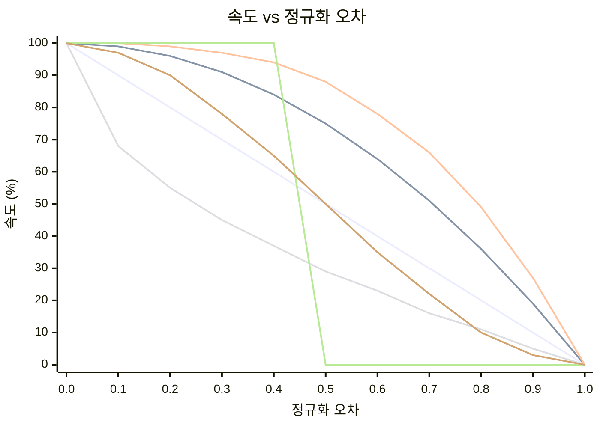

# OFDL PD ColorSpeed Controller — 사용 가이드

오류 기반 곡선을 사용하여 두 컬러 센서 값으로 모터 속도를 계산합니다. 로봇이 라인 중앙에 있을 때(센서 균형 상태), 속도는 최대(`BaseSpeed`)입니다. 오류가 커질수록 속도는 `MinSpeed`를 향해 낮아지며 — 낮아지는 형태는 선택한 모드에 따라 달라집니다.

---

## 개념

```
error = |P1 − P2|  (0 = centered, MaxError = fully off-line)

normalized_error = error / MaxError   (0.0 to 1.0)

speed = BaseSpeed − (BaseSpeed − MinSpeed) × f(normalized_error)
```

여기서 `f(x)`는 선택한 모드의 곡선 함수입니다:

| 모드 | 수식 `f(x)` | 동작 |
|------|-------------|------|
| `CS_Linear` | `x` | 오류에 따른 일정한 감속 |
| `CS_Quadratic` | `x²` | 처음에는 느리게 감소, 가장자리 근처에서 빠르게 |
| `CS_Cubic` | `x³` | 가장자리 근처에서 더욱 급격히 감소 |
| `CS_Sqrt` | `√x` | 중앙 근처에서 빠르게 감소, 가장자리에서 완만하게 |
| `CS_Step` | `0 if x<0.5, 1 if x≥0.5` | 절반까지 전속, 그 이후 MinSpeed |
| `CS_Smooth` | N 샘플에 걸쳐 평활화 | 센서 노이즈 스파이크 제거 |

### 곡선 형태 비교 (BaseSpeed=100, MinSpeed=0)



| 색상 | 모드 |
|------|------|
| 🔵 파랑 | `CS_Linear` |
| 🔴 빨강 | `CS_Quadratic` |
| 🟢 초록 | `CS_Cubic` |
| 🟣 보라 | `CS_Sqrt` |
| 🟠 주황 | `CS_Step` |
| 🟡 노랑 | `CS_Smooth` |

> ※ 색상은 Mermaid 테마 설정에 따라 다를 수 있습니다.

---

## 설정

### 1단계 — 구성 블록 (루프 전에 한 번 실행)

| 파라미터 | 설명 | 일반적인 값 |
|----------|------|-------------|
| **BaseSpeed** | 완벽히 중앙에 있을 때의 속도 (−100 ~ 100) | `50` |
| **MinSpeed** | 최대 오류 시 속도 (0 ~ 100) | `10` |
| **MaxError** | MinSpeed에 대응하는 오류 값 | `100` |
| **SmoothEnable** | 출력 평활화 활성화 | `False` |
| **SmoothLevel** | 평활화 윈도우 크기 (1–100) | `10` |

### 2단계 — 속도 블록 (매 루프 반복마다 실행)

| 파라미터 | 설명 |
|----------|------|
| **P1** | 왼쪽 컬러 센서 원시 값 |
| **P2** | 오른쪽 컬러 센서 원시 값 |

#### 출력

| 출력 | 설명 |
|------|------|
| **SpeedOut** | 모터에 적용할 계산된 속도 |
| **CS1Out** | 보정/전달된 P1 값 |
| **CS2Out** | 보정/전달된 P2 값 |

---

## 모드

| 모드 | 설명 |
|------|------|
| `Configuration` | BaseSpeed, MinSpeed, MaxError, 평활화 설정 |
| `CS_Linear` | 선형 속도 곡선 |
| `CS_Quadratic` | 이차 속도 곡선 |
| `CS_Cubic` | 삼차 속도 곡선 |
| `CS_Sqrt` | 제곱근 속도 곡선 |
| `CS_Step` | 계단 함수 (이진 속도) |
| `CS_Smooth` | 이동 평균을 사용한 평활화 출력 |

---

## 일반적인 루프 구조

```
[Configuration: BaseSpeed=60, MinSpeed=15, MaxError=100, SmoothEnable=False]

Loop:
  [Read Color Sensor 1] → P1
  [Read Color Sensor 2] → P2
  [CS_Quadratic: P1, P2] → SpeedOut
  [PD Controller PDpwr mode: Power=SpeedOut, P1, P2]
```

---

## 곡선 선택

| 상황 | 권장 모드 |
|------|-----------|
| 간단한 초기 설정 | `CS_Linear` |
| 직선 구간은 빠르게, 곡선에서는 느리게 | `CS_Quadratic` 또는 `CS_Cubic` |
| 센서 노이즈로 인한 속도 변동 | `CS_Smooth` |
| 임계값 동작 테스트 | `CS_Step` |
| 점진적인 감속 선호 | `CS_Sqrt` |

---

## 팁

- P1/P2에 입력하기 전에 먼저 **CS 보정** 블록을 사용하여 원시 센서 값을 0–100으로 정규화하세요.
- `SmoothEnable=True`와 `SmoothLevel=5–15`를 사용하면 눈에 띄는 지연 없이 노이즈가 많은 센서의 지터를 줄일 수 있습니다.
- 완전한 라인 추적 시스템을 위해 `SpeedOut`을 **PD 컨트롤러** (`PDpwr_*` 모드)와 결합하세요: ColorSpeed 블록이 기본 속도를 설정하고, PD가 방향을 제어합니다.
