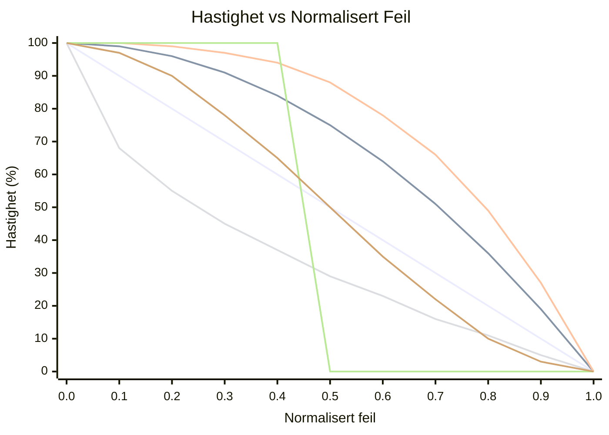

# OFDL PD ColorSpeed Controller — Brukerveiledning

Beregner motorhastighet fra to fargesensorverdier ved hjelp av en feilbasert kurve. Når roboten er sentrert på linjen (sensorene er i balanse), er hastigheten på sitt maksimum (`BaseSpeed`). Etter hvert som feilen øker, faller hastigheten mot `MinSpeed` — formen på fallet avhenger av valgt modus.

---

## Konsept

```
error = |P1 − P2|  (0 = centered, MaxError = fully off-line)

normalized_error = error / MaxError   (0.0 to 1.0)

speed = BaseSpeed − (BaseSpeed − MinSpeed) × f(normalized_error)
```

Der `f(x)` er kurvefunksjonen for valgt modus:

| Modus | Formel `f(x)` | Atferd |
|-------|---------------|--------|
| `CS_Linear` | `x` | Konstant deselearasjon med feilen |
| `CS_Quadratic` | `x²` | Langsomt fall i starten, raskt nær kanten |
| `CS_Cubic` | `x³` | Enda mer aggressivt nær kanten |
| `CS_Sqrt` | `√x` | Raskt fall nær sentrum, mykt ved kanten |
| `CS_Step` | `0 if x<0.5, 1 if x≥0.5` | Full fart til halvveis, deretter MinSpeed |
| `CS_Smooth` | glattet over N prøver | Fjerner sensorstøy-topper |

### Sammenligning av kurveform (BaseSpeed=100, MinSpeed=0)



| Farge | Modus |
|-------|-------|
| 🔵 Blå | `CS_Linear` |
| 🔴 Rød | `CS_Quadratic` |
| 🟢 Grønn | `CS_Cubic` |
| 🟣 Lilla | `CS_Sqrt` |
| 🟠 Oransje | `CS_Step` |
| 🟡 Gul | `CS_Smooth` |

> ※ Farger kan variere avhengig av Mermaid-temainnstillinger.

---

## Oppsett

### Trinn 1 — Konfigurasjonsblokk (kjør én gang før løkken)

| Parameter | Beskrivelse | Typisk verdi |
|-----------|-------------|--------------|
| **BaseSpeed** | Hastighet når perfekt sentrert (−100 til 100) | `50` |
| **MinSpeed** | Hastighet ved maksimal feil (0 til 100) | `10` |
| **MaxError** | Feilverdi som tilsvarer MinSpeed | `100` |
| **SmoothEnable** | Aktiver utgangs­utjevning | `False` |
| **SmoothLevel** | Utjevningsvinduets størrelse (1–100) | `10` |

### Trinn 2 — Hastighetsblokk (kjør ved hver løkkeitasjon)

| Parameter | Beskrivelse |
|-----------|-------------|
| **P1** | Rå verdi fra venstre fargesensor |
| **P2** | Rå verdi fra høyre fargesensor |

#### Utganger

| Utgang | Beskrivelse |
|--------|-------------|
| **SpeedOut** | Beregnet hastighet som skal brukes på motorene |
| **CS1Out** | Kalibrert/videresendt P1-verdi |
| **CS2Out** | Kalibrert/videresendt P2-verdi |

---

## Moduser

| Modus | Beskrivelse |
|-------|-------------|
| `Configuration` | Sett BaseSpeed, MinSpeed, MaxError, utjevning |
| `CS_Linear` | Lineær hastighetskurve |
| `CS_Quadratic` | Kvadratisk hastighetskurve |
| `CS_Cubic` | Kubisk hastighetskurve |
| `CS_Sqrt` | Kvadratrot­hastighetskurve |
| `CS_Step` | Trinnfunksjon (binær hastighet) |
| `CS_Smooth` | Glattet utgang med glidende gjennomsnitt |

---

## Typisk løkkestruktur

```
[Configuration: BaseSpeed=60, MinSpeed=15, MaxError=100, SmoothEnable=False]

Loop:
  [Read Color Sensor 1] → P1
  [Read Color Sensor 2] → P2
  [CS_Quadratic: P1, P2] → SpeedOut
  [PD Controller PDpwr mode: Power=SpeedOut, P1, P2]
```

---

## Valg av kurve

| Scenario | Anbefalt modus |
|----------|----------------|
| Enkel første oppsett | `CS_Linear` |
| Raske rette strekk, sakte i svinger | `CS_Quadratic` eller `CS_Cubic` |
| Sensorstøy forårsaker hastighetssvingninger | `CS_Smooth` |
| Testing av terskelatferd | `CS_Step` |
| Gradvis nedbremsing foretrukket | `CS_Sqrt` |

---

## Tips

- Bruk **CS Calibration**-blokken først for å normalisere rå sensorverdier til 0–100 før de sendes til P1/P2.
- `SmoothEnable=True` med `SmoothLevel=5–15` reduserer jitter på støyende sensorer uten mye forsinkelse.
- Kombiner `SpeedOut` med **PD Controller** (`PDpwr_*`-moduser) for et komplett linjefølgingssystem: ColorSpeed-blokken setter grunnhastigheten, og PD styrer.
