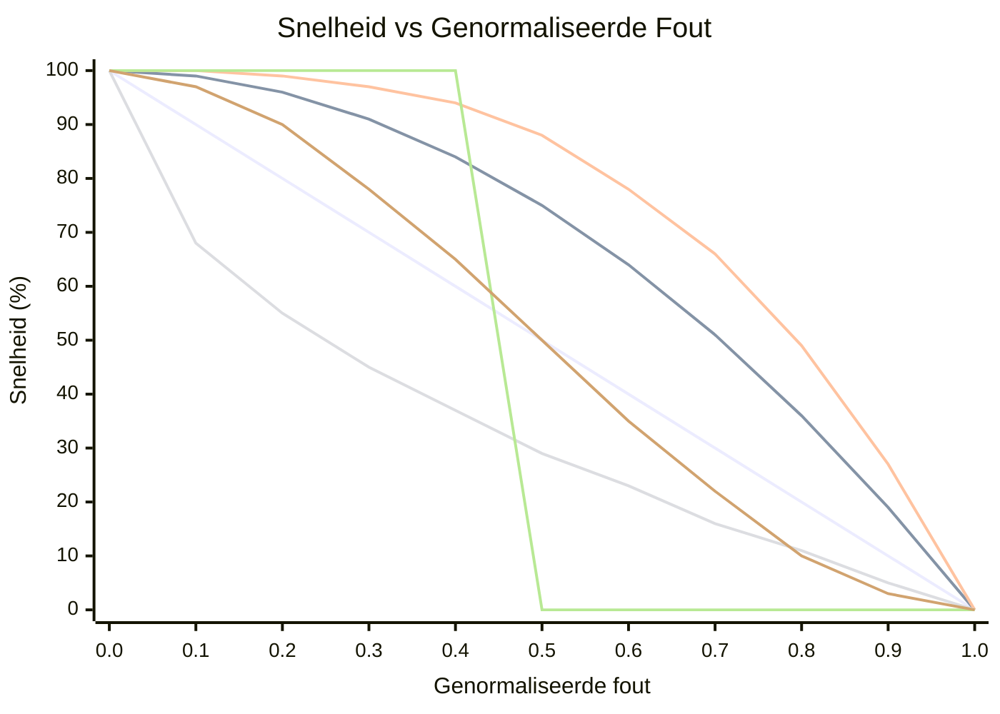

# OFDL PD ColorSpeed Controller — Gebruikershandleiding

Berekent de motorsnelheid uit twee kleurensensorwaarden met behulp van een foutgebaseerde curve. Wanneer de robot gecentreerd op de lijn staat (sensoren in balans), is de snelheid maximaal (`BaseSpeed`). Naarmate de fout groter wordt, daalt de snelheid naar `MinSpeed` — de vorm van de daling hangt af van de geselecteerde modus.

---

## Concept

```
error = |P1 − P2|  (0 = centered, MaxError = fully off-line)

normalized_error = error / MaxError   (0.0 to 1.0)

speed = BaseSpeed − (BaseSpeed − MinSpeed) × f(normalized_error)
```

Waarbij `f(x)` de curvefunctie is voor de geselecteerde modus:

| Modus | Formule `f(x)` | Gedrag |
|-------|----------------|--------|
| `CS_Linear` | `x` | Constante vertraging met fout |
| `CS_Quadratic` | `x²` | Langzame daling eerst, snel nabij rand |
| `CS_Cubic` | `x³` | Nog agressiever nabij rand |
| `CS_Sqrt` | `√x` | Snelle daling nabij centrum, zacht aan rand |
| `CS_Step` | `0 if x<0.5, 1 if x≥0.5` | Volle snelheid tot halverwege, dan MinSpeed |
| `CS_Smooth` | gedempt over N samples | Verwijdert sensorruis-pieken |

### Vergelijking van curvevorm (BaseSpeed=100, MinSpeed=0)



| Kleur | Modus |
|-------|-------|
| 🔵 Blauw | `CS_Linear` |
| 🔴 Rood | `CS_Quadratic` |
| 🟢 Groen | `CS_Cubic` |
| 🟣 Paars | `CS_Sqrt` |
| 🟠 Oranje | `CS_Step` |
| 🟡 Geel | `CS_Smooth` |

> ※ Kleuren kunnen variëren afhankelijk van de Mermaid-thema-instellingen.

---

## Instelling

### Stap 1 — Configuratieblok (één keer uitvoeren vóór de lus)

| Parameter | Beschrijving | Typische waarde |
|-----------|-------------|----------------|
| **BaseSpeed** | Snelheid wanneer perfect gecentreerd (−100 tot 100) | `50` |
| **MinSpeed** | Snelheid bij maximale fout (0 tot 100) | `10` |
| **MaxError** | Foutwaarde die overeenkomt met MinSpeed | `100` |
| **SmoothEnable** | Uitgangsdemping inschakelen | `False` |
| **SmoothLevel** | Dempingsvenstergrootte (1–100) | `10` |

### Stap 2 — Snelheidsblok (bij elke lusiteratie uitvoeren)

| Parameter | Beschrijving |
|-----------|-------------|
| **P1** | Ruwe waarde linker kleurensensor |
| **P2** | Ruwe waarde rechter kleurensensor |

#### Uitgangen

| Uitgang | Beschrijving |
|---------|-------------|
| **SpeedOut** | Berekende snelheid toe te passen op motoren |
| **CS1Out** | Gekalibreerde/doorgegeven P1-waarde |
| **CS2Out** | Gekalibreerde/doorgegeven P2-waarde |

---

## Modi

| Modus | Beschrijving |
|-------|-------------|
| `Configuration` | BaseSpeed, MinSpeed, MaxError, demping instellen |
| `CS_Linear` | Lineaire snelheidscurve |
| `CS_Quadratic` | Kwadratische snelheidscurve |
| `CS_Cubic` | Kubische snelheidscurve |
| `CS_Sqrt` | Vierkantswortel snelheidscurve |
| `CS_Step` | Stapfunctie (binaire snelheid) |
| `CS_Smooth` | Gedempte uitgang met voortschrijdend gemiddelde |

---

## Typische lusstructuur

```
[Configuration: BaseSpeed=60, MinSpeed=15, MaxError=100, SmoothEnable=False]

Loop:
  [Read Color Sensor 1] → P1
  [Read Color Sensor 2] → P2
  [CS_Quadratic: P1, P2] → SpeedOut
  [PD Controller PDpwr mode: Power=SpeedOut, P1, P2]
```

---

## Een curve kiezen

| Scenario | Aanbevolen modus |
|----------|-----------------|
| Eenvoudige eerste instelling | `CS_Linear` |
| Snelle rechte stukken, langzaam in bochten | `CS_Quadratic` of `CS_Cubic` |
| Sensorruis veroorzaakt snelheidsschommelingen | `CS_Smooth` |
| Drempelgedrag testen | `CS_Step` |
| Geleidelijk vertragen verdient voorkeur | `CS_Sqrt` |

---

## Tips

- Gebruik eerst het **CS Calibration**-blok om ruwe sensorwaarden te normaliseren naar 0–100 voordat u ze in P1/P2 invoert.
- `SmoothEnable=True` met `SmoothLevel=5–15` vermindert jitter op ruizige sensoren zonder veel vertraging.
- Combineer `SpeedOut` met de **PD Controller** (modi `PDpwr_*`) voor een compleet lijnvolgsysteem: het ColorSpeed-blok stelt de basissnelheid in en PD stuurt.
