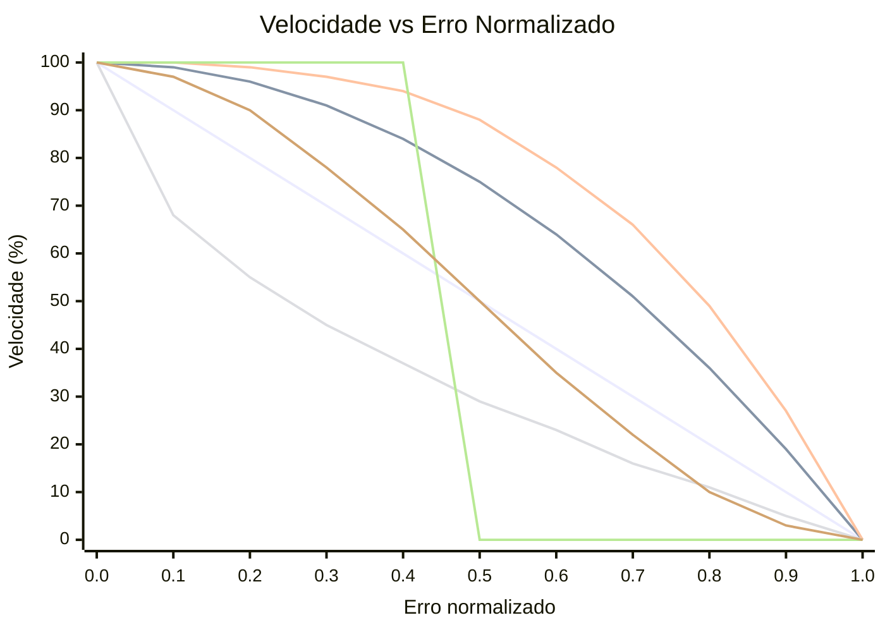

# OFDL PD ColorSpeed Controller — Guia de uso

Calcula a velocidade do motor a partir de dois valores de sensor de cor usando uma curva baseada em erro. Quando o robô está centralizado na linha (sensores balanceados), a velocidade está no máximo (`BaseSpeed`). À medida que o erro cresce, a velocidade cai em direção a `MinSpeed` — a forma da queda depende do modo selecionado.

---

## Conceito

```
error = |P1 − P2|  (0 = centered, MaxError = fully off-line)

normalized_error = error / MaxError   (0.0 to 1.0)

speed = BaseSpeed − (BaseSpeed − MinSpeed) × f(normalized_error)
```

Onde `f(x)` é a função de curva para o modo selecionado:

| Modo | Fórmula `f(x)` | Comportamento |
|------|----------------|--------------|
| `CS_Linear` | `x` | Desaceleração constante com o erro |
| `CS_Quadratic` | `x²` | Queda lenta no início, rápida perto da borda |
| `CS_Cubic` | `x³` | Ainda mais agressivo perto da borda |
| `CS_Sqrt` | `√x` | Queda rápida perto do centro, suave na borda |
| `CS_Step` | `0 if x<0.5, 1 if x≥0.5` | Velocidade máxima até a metade, depois MinSpeed |
| `CS_Smooth` | suavizado ao longo de N amostras | Remove picos de ruído do sensor |

### Comparação das formas de curva (BaseSpeed=100, MinSpeed=0)



| Cor | Modo |
|-----|------|
| 🔵 Azul | `CS_Linear` |
| 🔴 Vermelho | `CS_Quadratic` |
| 🟢 Verde | `CS_Cubic` |
| 🟣 Roxo | `CS_Sqrt` |
| 🟠 Laranja | `CS_Step` |
| 🟡 Amarelo | `CS_Smooth` |

> ※ As cores podem variar dependendo das configurações do tema Mermaid.

---

## Configuração

### Passo 1 — Bloco de configuração (executar uma vez antes do laço)

| Parâmetro | Descrição | Valor típico |
|-----------|-----------|-------------|
| **BaseSpeed** | Velocidade quando perfeitamente centralizado (−100 a 100) | `50` |
| **MinSpeed** | Velocidade no erro máximo (0 a 100) | `10` |
| **MaxError** | Valor de erro que corresponde a MinSpeed | `100` |
| **SmoothEnable** | Habilitar suavização da saída | `False` |
| **SmoothLevel** | Tamanho da janela de suavização (1–100) | `10` |

### Passo 2 — Bloco de velocidade (executar em cada iteração do laço)

| Parâmetro | Descrição |
|-----------|-----------|
| **P1** | Valor bruto do sensor de cor esquerdo |
| **P2** | Valor bruto do sensor de cor direito |

#### Saídas

| Saída | Descrição |
|-------|-----------|
| **SpeedOut** | Velocidade calculada a aplicar aos motores |
| **CS1Out** | Valor P1 calibrado/repassado |
| **CS2Out** | Valor P2 calibrado/repassado |

---

## Modos

| Modo | Descrição |
|------|-----------|
| `Configuration` | Definir BaseSpeed, MinSpeed, MaxError, suavização |
| `CS_Linear` | Curva de velocidade linear |
| `CS_Quadratic` | Curva de velocidade quadrática |
| `CS_Cubic` | Curva de velocidade cúbica |
| `CS_Sqrt` | Curva de velocidade raiz quadrada |
| `CS_Step` | Função degrau (velocidade binária) |
| `CS_Smooth` | Saída suavizada com média móvel |

---

## Estrutura típica do laço

```
[Configuration: BaseSpeed=60, MinSpeed=15, MaxError=100, SmoothEnable=False]

Loop:
  [Read Color Sensor 1] → P1
  [Read Color Sensor 2] → P2
  [CS_Quadratic: P1, P2] → SpeedOut
  [PD Controller PDpwr mode: Power=SpeedOut, P1, P2]
```

---

## Como escolher uma curva

| Cenário | Modo recomendado |
|---------|-----------------|
| Primeira configuração simples | `CS_Linear` |
| Seções retas rápidas, curvas lentas | `CS_Quadratic` ou `CS_Cubic` |
| Ruído do sensor causando flutuação de velocidade | `CS_Smooth` |
| Testar comportamento de limiar | `CS_Step` |
| Desaceleração gradual preferida | `CS_Sqrt` |

---

## Dicas

- Use primeiro o bloco **CS Calibration** para normalizar os valores brutos do sensor para 0–100 antes de alimentá-los em P1/P2.
- `SmoothEnable=True` com `SmoothLevel=5–15` reduz o jitter em sensores com ruído sem muita latência.
- Combine `SpeedOut` com o **PD Controller** (modos `PDpwr_*`) para um sistema completo de seguimento de linha: o bloco ColorSpeed define a velocidade base e o PD dirige.
