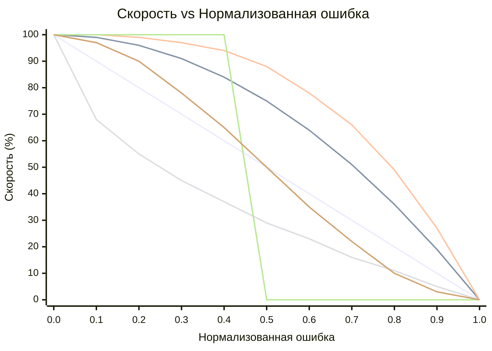

# OFDL PD ColorSpeed Controller — Руководство по использованию

Вычисляет скорость мотора по показаниям двух датчиков цвета, используя кривую на основе ошибки. Когда робот центрован на линии (датчики сбалансированы), скорость максимальна (`BaseSpeed`). По мере роста ошибки скорость снижается до `MinSpeed` — форма снижения зависит от выбранного режима.

---

## Концепция

```
error = |P1 − P2|  (0 = centered, MaxError = fully off-line)

normalized_error = error / MaxError   (0.0 to 1.0)

speed = BaseSpeed − (BaseSpeed − MinSpeed) × f(normalized_error)
```

Где `f(x)` — функция кривой для выбранного режима:

| Режим | Формула `f(x)` | Поведение |
|-------|----------------|-----------|
| `CS_Linear` | `x` | Постоянное замедление с ростом ошибки |
| `CS_Quadratic` | `x²` | Медленное снижение вначале, резкое у края |
| `CS_Cubic` | `x³` | Ещё более резкое у края |
| `CS_Sqrt` | `√x` | Быстрое снижение вблизи центра, мягкое у края |
| `CS_Step` | `0 if x<0.5, 1 if x≥0.5` | Полная скорость до середины, затем MinSpeed |
| `CS_Smooth` | сглаживание по N отсчётам | Устраняет выбросы шума датчика |

### Сравнение форм кривых (BaseSpeed=100, MinSpeed=0)



| Цвет | Режим |
|------|-------|
| 🔵 Синий | `CS_Linear` |
| 🔴 Красный | `CS_Quadratic` |
| 🟢 Зелёный | `CS_Cubic` |
| 🟣 Фиолетовый | `CS_Sqrt` |
| 🟠 Оранжевый | `CS_Step` |
| 🟡 Жёлтый | `CS_Smooth` |

> ※ Цвета могут различаться в зависимости от темы Mermaid.

---

## Настройка

### Шаг 1 — Блок конфигурации (запускается один раз перед циклом)

| Параметр | Описание | Типичное значение |
|----------|----------|-------------------|
| **BaseSpeed** | Скорость при идеальном центровании (−100 до 100) | `50` |
| **MinSpeed** | Скорость при максимальной ошибке (0 до 100) | `10` |
| **MaxError** | Значение ошибки, соответствующее MinSpeed | `100` |
| **SmoothEnable** | Включить сглаживание выходного сигнала | `False` |
| **SmoothLevel** | Размер окна сглаживания (1–100) | `10` |

### Шаг 2 — Блок скорости (запускается на каждой итерации цикла)

| Параметр | Описание |
|----------|----------|
| **P1** | Сырое значение левого датчика цвета |
| **P2** | Сырое значение правого датчика цвета |

#### Выходные данные

| Выход | Описание |
|-------|----------|
| **SpeedOut** | Рассчитанная скорость для подачи на моторы |
| **CS1Out** | Откалиброванное/переданное значение P1 |
| **CS2Out** | Откалиброванное/переданное значение P2 |

---

## Режимы

| Режим | Описание |
|-------|----------|
| `Configuration` | Задать BaseSpeed, MinSpeed, MaxError, сглаживание |
| `CS_Linear` | Линейная кривая скорости |
| `CS_Quadratic` | Квадратичная кривая скорости |
| `CS_Cubic` | Кубическая кривая скорости |
| `CS_Sqrt` | Кривая скорости по квадратному корню |
| `CS_Step` | Ступенчатая функция (бинарная скорость) |
| `CS_Smooth` | Сглаженный вывод с использованием скользящего среднего |

---

## Типичная структура цикла

```
[Configuration: BaseSpeed=60, MinSpeed=15, MaxError=100, SmoothEnable=False]

Loop:
  [Read Color Sensor 1] → P1
  [Read Color Sensor 2] → P2
  [CS_Quadratic: P1, P2] → SpeedOut
  [PD Controller PDpwr mode: Power=SpeedOut, P1, P2]
```

---

## Выбор кривой

| Сценарий | Рекомендуемый режим |
|----------|---------------------|
| Первоначальная простая настройка | `CS_Linear` |
| Быстрые прямые участки, медленные повороты | `CS_Quadratic` или `CS_Cubic` |
| Шум датчика вызывает колебания скорости | `CS_Smooth` |
| Тестирование порогового поведения | `CS_Step` |
| Предпочтительно плавное замедление | `CS_Sqrt` |

---

## Советы

- Сначала используйте блок **калибровки CS**, чтобы нормализовать сырые значения датчиков к 0–100 перед подачей в P1/P2.
- `SmoothEnable=True` с `SmoothLevel=5–15` уменьшает дрожание на зашумлённых датчиках без значительной задержки.
- Комбинируйте `SpeedOut` с **PD-контроллером** (режимы `PDpwr_*`) для полноценной системы слежения за линией: блок ColorSpeed задаёт базовую скорость, а PD управляет рулением.
