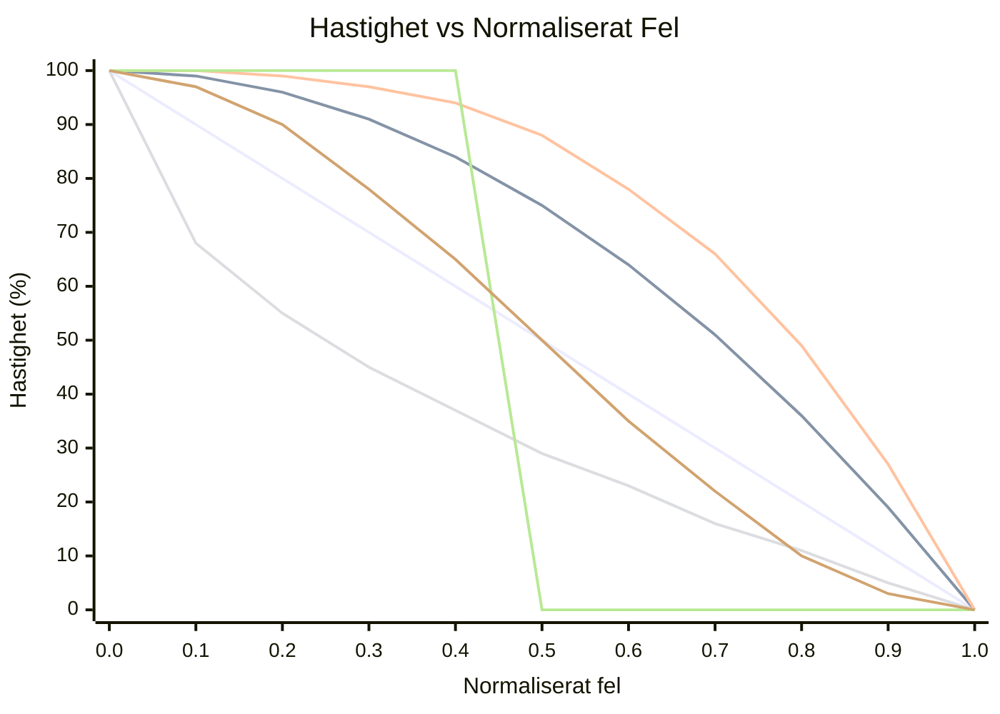

# OFDL PD ColorSpeed Controller — Användarguide

Beräknar motorhastighet från två färgsensorvärden med hjälp av en felbaserad kurva. När roboten är centrerad på linjen (sensorerna är i balans) är hastigheten på sitt maximum (`BaseSpeed`). När felet ökar sjunker hastigheten mot `MinSpeed` — formen på sjunkningen beror på valt läge.

---

## Koncept

```
error = |P1 − P2|  (0 = centered, MaxError = fully off-line)

normalized_error = error / MaxError   (0.0 to 1.0)

speed = BaseSpeed − (BaseSpeed − MinSpeed) × f(normalized_error)
```

Där `f(x)` är kurvfunktionen för valt läge:

| Läge | Formel `f(x)` | Beteende |
|------|---------------|----------|
| `CS_Linear` | `x` | Konstant deceleration med felet |
| `CS_Quadratic` | `x²` | Långsamt fall i början, snabbt nära kanten |
| `CS_Cubic` | `x³` | Ännu mer aggressivt nära kanten |
| `CS_Sqrt` | `√x` | Snabbt fall nära centrum, mjukt vid kanten |
| `CS_Step` | `0 if x<0.5, 1 if x≥0.5` | Full fart till halvvägs, sedan MinSpeed |
| `CS_Smooth` | utjämnat över N prover | Tar bort sensorbrusstockar |

### Jämförelse av kurvform (BaseSpeed=100, MinSpeed=0)



| Färg | Läge |
|------|------|
| 🔵 Blå | `CS_Linear` |
| 🔴 Röd | `CS_Quadratic` |
| 🟢 Grön | `CS_Cubic` |
| 🟣 Lila | `CS_Sqrt` |
| 🟠 Orange | `CS_Step` |
| 🟡 Gul | `CS_Smooth` |

> ※ Färger kan variera beroende på Mermaid-temainställningar.

---

## Inställning

### Steg 1 — Konfigurationsblock (kör en gång före loopen)

| Parameter | Beskrivning | Typiskt värde |
|-----------|-------------|---------------|
| **BaseSpeed** | Hastighet när perfekt centrerad (−100 till 100) | `50` |
| **MinSpeed** | Hastighet vid maximalt fel (0 till 100) | `10` |
| **MaxError** | Felvärde som motsvarar MinSpeed | `100` |
| **SmoothEnable** | Aktivera utdatautjämning | `False` |
| **SmoothLevel** | Utjämningsfönstrets storlek (1–100) | `10` |

### Steg 2 — Hastighetsblock (kör vid varje loopcykel)

| Parameter | Beskrivning |
|-----------|-------------|
| **P1** | Råvärde från vänster färgsensor |
| **P2** | Råvärde från höger färgsensor |

#### Utdata

| Utdata | Beskrivning |
|--------|-------------|
| **SpeedOut** | Beräknad hastighet att applicera på motorerna |
| **CS1Out** | Kalibrerat/vidarebefordrat P1-värde |
| **CS2Out** | Kalibrerat/vidarebefordrat P2-värde |

---

## Lägen

| Läge | Beskrivning |
|------|-------------|
| `Configuration` | Ange BaseSpeed, MinSpeed, MaxError, utjämning |
| `CS_Linear` | Linjär hastighetskurva |
| `CS_Quadratic` | Kvadratisk hastighetskurva |
| `CS_Cubic` | Kubisk hastighetskurva |
| `CS_Sqrt` | Kvadratrotshastighetskurva |
| `CS_Step` | Stegfunktion (binär hastighet) |
| `CS_Smooth` | Utjämnad utdata med glidande medelvärde |

---

## Typisk loopstruktur

```
[Configuration: BaseSpeed=60, MinSpeed=15, MaxError=100, SmoothEnable=False]

Loop:
  [Read Color Sensor 1] → P1
  [Read Color Sensor 2] → P2
  [CS_Quadratic: P1, P2] → SpeedOut
  [PD Controller PDpwr mode: Power=SpeedOut, P1, P2]
```

---

## Val av kurva

| Scenario | Rekommenderat läge |
|----------|--------------------|
| Enkel första inställning | `CS_Linear` |
| Snabba raka sträckor, långsam i kurvor | `CS_Quadratic` eller `CS_Cubic` |
| Sensorbrus orsakar hastighetsvariationer | `CS_Smooth` |
| Testa tröskelbeteende | `CS_Step` |
| Gradvis inbromsning föredras | `CS_Sqrt` |

---

## Tips

- Använd **CS Calibration**-blocket först för att normalisera råa sensorvärden till 0–100 innan de matas till P1/P2.
- `SmoothEnable=True` med `SmoothLevel=5–15` minskar jitter på brusiga sensorer utan mycket fördröjning.
- Kombinera `SpeedOut` med **PD Controller** (`PDpwr_*`-lägen) för ett komplett linjeföljningssystem: ColorSpeed-blocket ställer in grundhastigheten och PD styr.
