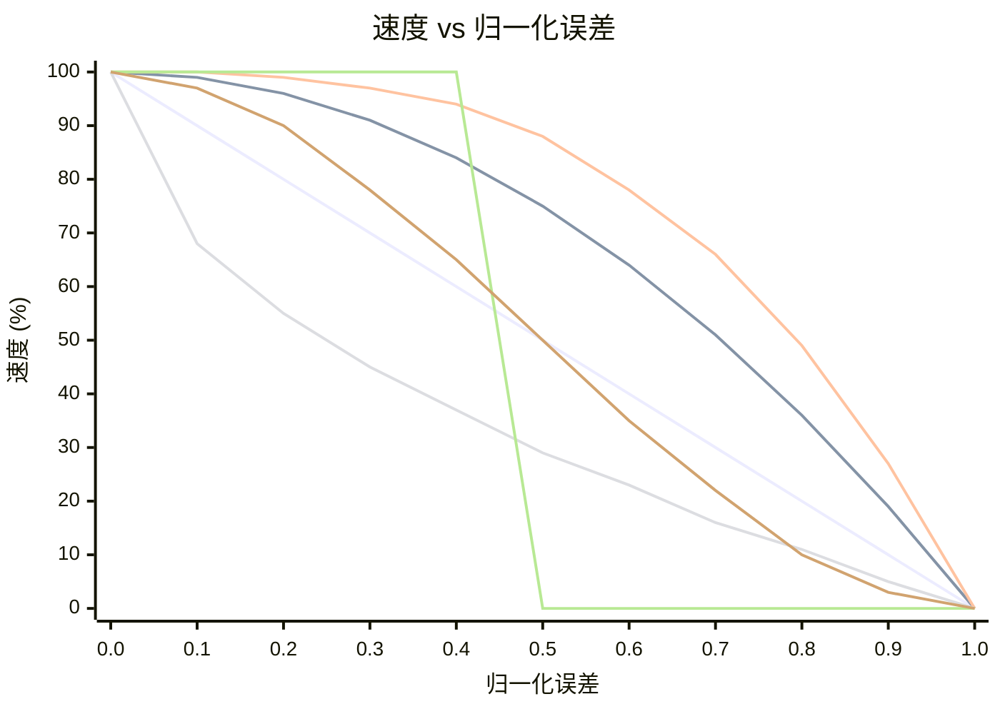

# OFDL PD ColorSpeed Controller — 使用指南

使用基于误差的曲线，根据两个颜色传感器的值计算电机速度。当机器人在线的中心位置时（传感器平衡），速度处于最大值（`BaseSpeed`）。随着误差增大，速度向 `MinSpeed` 下降 — 下降的形状取决于所选模式。

---

## 概念

```
error = |P1 − P2|  (0 = centered, MaxError = fully off-line)

normalized_error = error / MaxError   (0.0 to 1.0)

speed = BaseSpeed − (BaseSpeed − MinSpeed) × f(normalized_error)
```

其中 `f(x)` 是所选模式的曲线函数：

| 模式 | 公式 `f(x)` | 行为 |
|------|-------------|------|
| `CS_Linear` | `x` | 随误差恒定减速 |
| `CS_Quadratic` | `x²` | 初始下降缓慢，接近边缘时快速 |
| `CS_Cubic` | `x³` | 接近边缘时更加急剧 |
| `CS_Sqrt` | `√x` | 靠近中心时快速下降，接近边缘时平缓 |
| `CS_Step` | `0 if x<0.5, 1 if x≥0.5` | 达到一半前全速，之后为MinSpeed |
| `CS_Smooth` | 在N个样本上平滑 | 消除传感器噪声尖峰 |

### 曲线形状对比（BaseSpeed=100，MinSpeed=0）



| 颜色 | 模式 |
|------|------|
| 🔵 蓝 | `CS_Linear` |
| 🔴 红 | `CS_Quadratic` |
| 🟢 绿 | `CS_Cubic` |
| 🟣 紫 | `CS_Sqrt` |
| 🟠 橙 | `CS_Step` |
| 🟡 黄 | `CS_Smooth` |

> ※ 颜色可能因 Mermaid 主题设置而有所不同。

---

## 设置

### 第一步 — 配置块（在循环前运行一次）

| 参数 | 说明 | 典型值 |
|------|------|--------|
| **BaseSpeed** | 完全居中时的速度（−100 到 100） | `50` |
| **MinSpeed** | 最大误差时的速度（0 到 100） | `10` |
| **MaxError** | 对应 MinSpeed 的误差值 | `100` |
| **SmoothEnable** | 启用输出平滑 | `False` |
| **SmoothLevel** | 平滑窗口大小（1–100） | `10` |

### 第二步 — 速度块（每次循环迭代时运行）

| 参数 | 说明 |
|------|------|
| **P1** | 左侧颜色传感器原始值 |
| **P2** | 右侧颜色传感器原始值 |

#### 输出

| 输出 | 说明 |
|------|------|
| **SpeedOut** | 计算出的应用于电机的速度 |
| **CS1Out** | 校准/传递的P1值 |
| **CS2Out** | 校准/传递的P2值 |

---

## 模式

| 模式 | 说明 |
|------|------|
| `Configuration` | 设置 BaseSpeed、MinSpeed、MaxError、平滑 |
| `CS_Linear` | 线性速度曲线 |
| `CS_Quadratic` | 二次速度曲线 |
| `CS_Cubic` | 三次速度曲线 |
| `CS_Sqrt` | 平方根速度曲线 |
| `CS_Step` | 阶跃函数（二值速度） |
| `CS_Smooth` | 使用滚动平均的平滑输出 |

---

## 典型循环结构

```
[Configuration: BaseSpeed=60, MinSpeed=15, MaxError=100, SmoothEnable=False]

Loop:
  [Read Color Sensor 1] → P1
  [Read Color Sensor 2] → P2
  [CS_Quadratic: P1, P2] → SpeedOut
  [PD Controller PDpwr mode: Power=SpeedOut, P1, P2]
```

---

## 曲线选择

| 场景 | 推荐模式 |
|------|----------|
| 简单初次设置 | `CS_Linear` |
| 直线段快速，弯道减速 | `CS_Quadratic` 或 `CS_Cubic` |
| 传感器噪声导致速度波动 | `CS_Smooth` |
| 测试阈值行为 | `CS_Step` |
| 偏好渐进式减速 | `CS_Sqrt` |

---

## 提示

- 在输入P1/P2之前，先使用 **CS校准**块将传感器原始值归一化到0–100。
- `SmoothEnable=True` 配合 `SmoothLevel=5–15` 可在不明显增加延迟的情况下减少噪声传感器上的抖动。
- 将 `SpeedOut` 与 **PD控制器**（`PDpwr_*` 模式）结合使用，构建完整的巡线系统：ColorSpeed块设置基础速度，PD控制转向。
